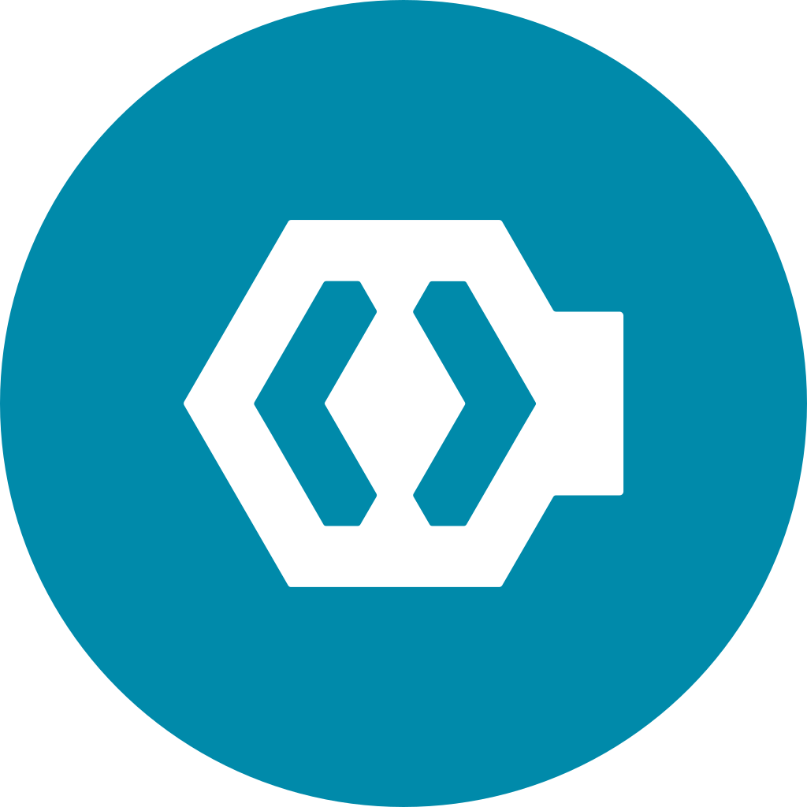
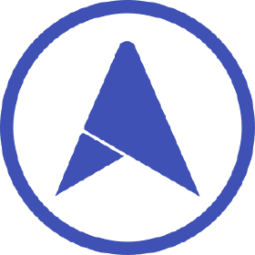

Hi My name is Abhishek Singh
======================================================================================================================================

DevOps Engineer
---------------
 

I'm Abhishek Singh, a seasoned DevOps engineer with 4 years of experience in Kubernetes, Docker, Ansible, monitoring, logging, and CI/CD. I've worked with clients like **Zenatix**, **QuickRide**, **ADTL**, building and maintaining their DevOps infrastructure. My expertise lies in Kubernetes containerization, orchestration, and scaling. I design CI/CD pipelines for quick and reliable software delivery, focusing on monitoring and logging for optimal system performance. I promote collaboration between development and operations teams and enjoy exploring new technologies and contributing to open-source projects.
 
 

*   🌍  I'm based in Bangalore
*   🖥️  See my portfolio at [Profile](https://iam-abhishek.netlify.app)
*   ✉️   You can contact me at [abhishek.abvp.as@gmail.com](mailto:abhishek.abvp.as@gmail.com)
*   🚀  I'm currently working on [Modded Minecraft Servers](http://github.com/asabhi6776/minecraft_server.git)
*   📝  I regularly write articles on [Myblogs](https://opscribe.site)
*   🧠  I'm learning Python, Terraform and Groovy
*   🤝  I'm open to collaborating on Minecraft Server, K8s and Automation.
*   💬  Ask me about **Kubernetes, Docker and Virtualization**
*   ⚡  Fun fact **I love cat videos.**

### 📫 How to reach me

### 🔭 I’m currently working on ...

### 🌱 I have experience on ...

<!--

-->

### :book: Blog posts
<!-- BLOG-POST-LIST:START -->
- [Chaos Engineering: Building Resilient Systems Through Deliberate Disruption](https://opscribe.site/chaos-engineering-building-resilient-systems-through-deliberate-disruption)
- [Istio: Understanding and Installation](https://opscribe.site/istio-understanding-and-installation)
- [Unlocking AWS Power for Microservices: A Guide to IAM Roles for Service Accounts &lpar;IRSA&rpar;](https://opscribe.site/iam-roles-for-service-accounts-irsa)
- [Integrating NFS as a storage class in Kubernetes cluster](https://opscribe.site/integrating-nfs-as-a-storage-class-in-kubernetes-cluster)
<!-- BLOG-POST-LIST:END -->

## 📈 Stats

	
  
  

 

### Support:

